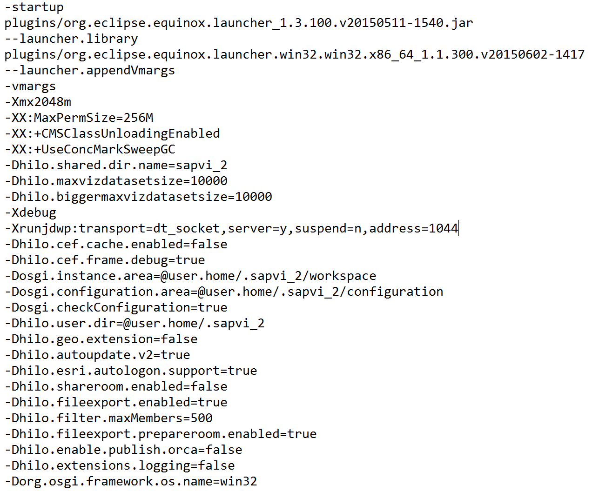
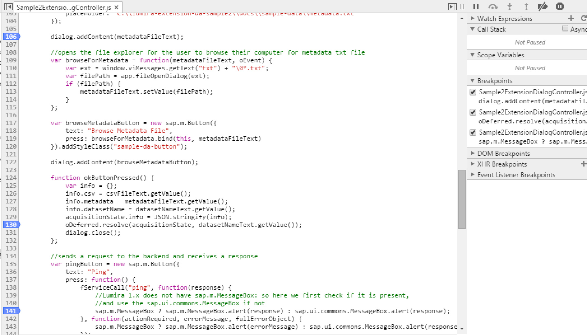
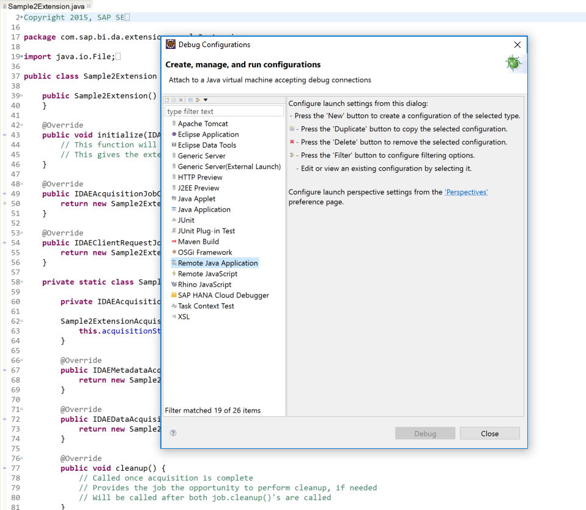
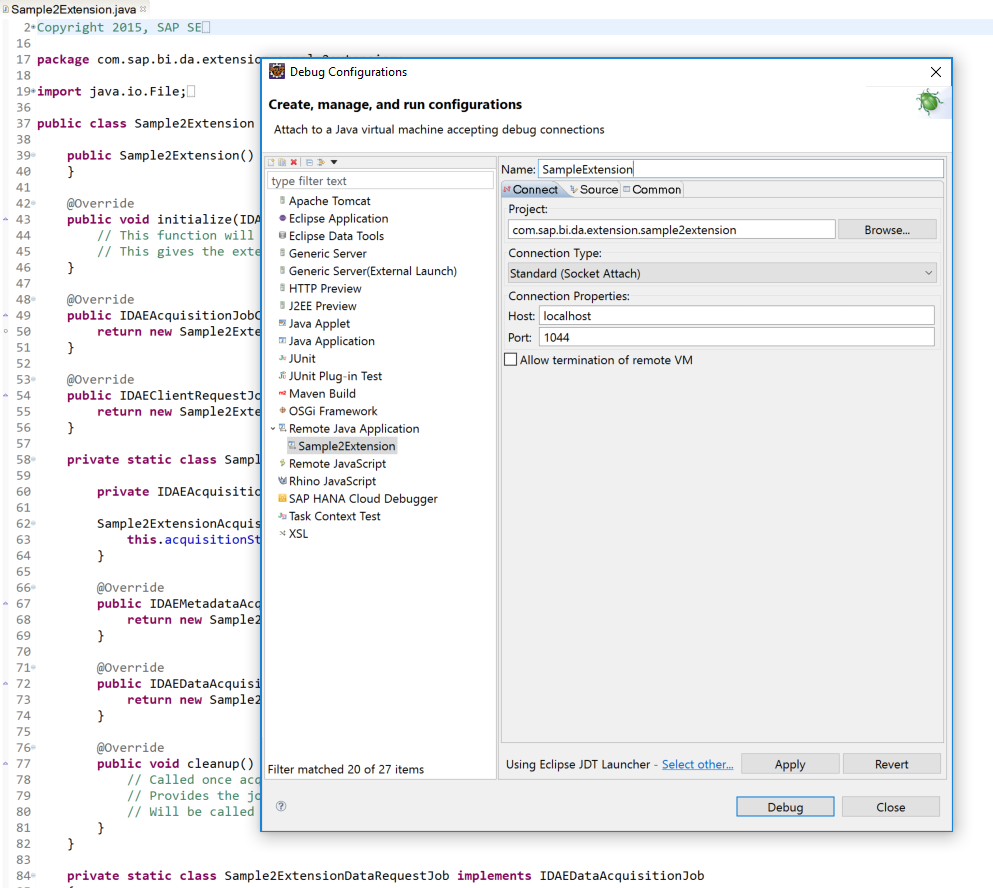
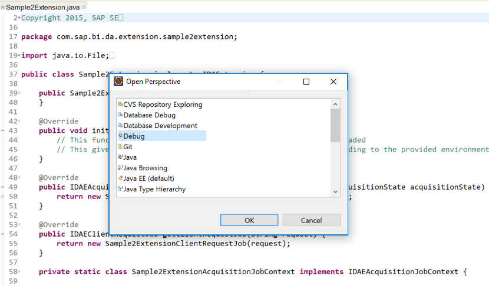
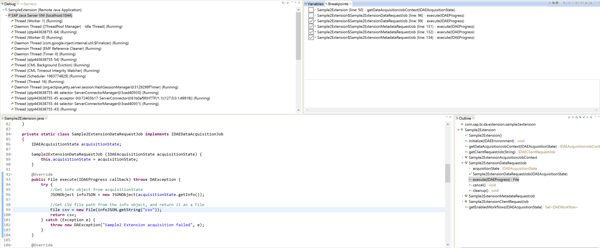

## Debugging
In order to enable debugging, you modify the .ini file located within your Lumira installation folder:

E.g. C: > Program Files > SAP Lumira > Desktop > SAPLumira.ini

Or similarly in Lumira 2.x Discovery:

E.g. C: > Program Files > SAP BusinessObjects Lumira > Lumira Discovery >  Desktop > SBOPLumiraDiscovery.ini

Note that you need to have all file types showing in your file explorer, and also that you need to open the .ini file in a plain text editor (e.g. Notepad)  as an Administrator to edit it. 

Next, add the following lines to the .ini file: 

```
-Xdebug 
```

```
-Xrunjdwp:transport=dt_socket,server=y,suspend=n,address=1044
```

Also, add these lines or change their values to match below:

```
-Dhilo.cef.cache.enabled=false 
```

```
-Dhilo.cef.frame.debug=true
```



Now, restart Lumira and you will be able to debug your code. 

### User Interface (client)
To debug the user interface, right-click on Lumira and select “Show DevTools” from the dropdown menu to open the developer tools window.

*photo of dropdown

Here you can set breakpoints, check the JavaScript console, inspect UI elements, etc. ---- just like you would in a web browser. 

To view and set breakpoints in your extension’s JavaScript files, navigate to the “Sources” tab in the developer tools window. Then, go to 

sap/bi > bundles/com/sap/bi/da/extension > EXTENSION_NAME



### Backend
Since the backend runs separately, in a Java Virtual Machine, you can use Eclipse to remote debug your Java code.

Open your extension in Eclipse, navigate to “Run” in the top menu bar, and select “Debug configurations” from the dropdown.

To create a new debug configuration, select “Remote Java Application”. 



Give it a name, browse to the project folder for the extension you will be debugging, and enter 1044 as the port (which we specified in the .ini file). Make sure Lumira is running, and then press “Debug”.



Click the perspectives icon in the upper-right corner of Eclipse and select “Debug” to open the debug perspective. 


<br>

Here, you can set breakpoints and debug your Java code.
<br>


Now that we are familiar with debugging extensions, let's walk through how to build our own using the sample extension as starter code.

### [Twitter Data Access Extension example](https://github.com/denzalereese/lumira-extension-da-twitter)
### [Sample Extension](./sample-da.md)
### [Back to Overview](../../README.md)
