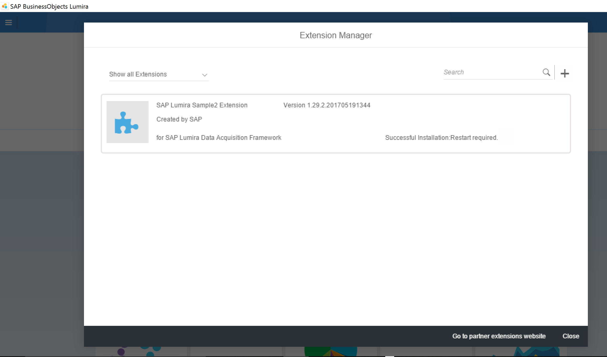

# Data Access Extensions

This repo contains a Sample Data Access extension that can be used as starter code for you to build your own. Read below for more information on Data Access Extensions for SAP Lumira, walkthroughs, and tutorials. 

(If you already familiar with building Data Access extensions, feel free to  skip to downloading this repo and/or using the [Quickstart Guide](./Docs/walkthrough/quickstart.md).) 

## Overview 
SAP Lumira 1.x and 2.x Discovery are self-service data visualization tools that make it easy to create interactive maps, charts, and infographics. Import & clean data from a variety of sources, build visualizations, and share stunning dashboards. 

Though Lumira comes with a variety of possible visualizations and data connectors out of the box, you may also want something more specific to fit the use cases in your story. Lumira is also a platform that ships with an SDK, enabling you to build custom visualization and data access extensions that directly match your needs. 

## Introduction 
SAP Lumira allows you to import data from a variety of places like CSV, Excel, and SAP HANA. We understand that your data may come from a different source, and that the ever-changing data industry requires flexibility to what new sources may emerge. For this reason, you can further expand Lumira with “Data Access Extensions”  that integrate Lumira with custom data connections. Examples of Data Access Extensions can include integration with REST API’s, Google Sheets, social networks, etc. ---- the possibilities are vast. This repo contains the code for a Sample Data Access extension. You can download the extension zip here, follow the instructions below to install it in Lumira, and check out the walkthroughs to learn more about building your own.  

### Installing Data Access Extensions
You can use the “Extension Manager” to easily install existing Data Access Extensions, or ones you have built yourself:

- Open SAP Lumira (1.29+ or 2.x Discovery)
- Select File > Extensions to open the Extension Manager (or Ctrl + J)
- Click “Manual Installation” in the bottom-right corner & navigate to the extension zip file
- Restart Lumira, and the extension will appear in the list of possible data sources when creating a new document 

### Architecture
There are two parts of an extension: The user interface (client) and the backend. The user interface captures your query input, and the backend fetches the data based on those parameters.

The user interface is created with JavaScript, and typically a dialog that is displayed when the extension is opened in Lumira. Preview screens and functionality can be completely customized to fit the requirements of the extension. You can also save query parameters along with your Lumira document, or opt for runtime parameters that do not persist when Lumira is closed (e.g. usernames & passwords). 

The backend is created with Java, and reads the query parameters that you input in the user interface. It then fetches the data, converts the data to a CSV file, and imports the data into Lumira. For import, the backend also supplies JSON metadata to classify your data into measures and dimensions.

To get started, check out the "Sample Extension" (code in this repo) and "Debugging" walkthroughs:

### [Sample Extension](./Docs/walkthrough/sample-da.md)
### [Debugging](./Docs/walkthrough/debugging.md)

Then, learn more about building your own extension using this sample, by following the Twitter extension example tutorial:

### [Building Data Access Extensions](https://github.com/denzalereese/lumira-extension-da-twitter)

### [Quickstart Guide](./Docs/walkthrough/quickstart.md)

